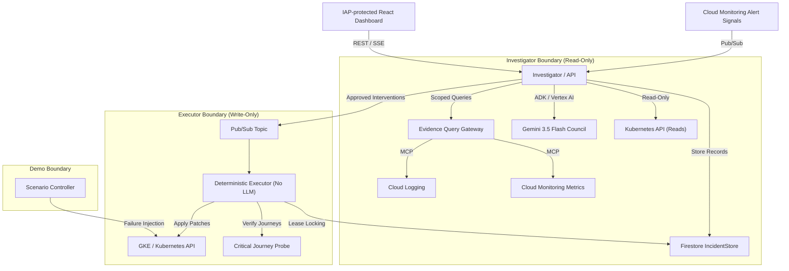

# KubeCouncil

KubeCouncil is a Kubernetes-native, multi-agent incident response and remediation platform. It acts as an AI SRE intelligence and control layer for explicitly enrolled GKE workloads, turning operational evidence and monitoring signals into policy-checked remediation proposals, obtaining authenticated human approval, executing changes via a privilege-separated executor, and verifying customer-path recovery.

Originally designed around repository-driven rehearsal twins, KubeCouncil has evolved (per **KC-12**) into a Kubernetes-native incident response platform that operates directly on live, enrolled applications on GKE (using Online Boutique as its primary demonstration target).

---

## Core Product Workflow

KubeCouncil operates on a continuous feedback loop divided into distinct phases:

1. **Detect**: Ingests external alert signals (e.g., Cloud Monitoring alerts) through a Workload Identity-authenticated Pub/Sub pull subscription, or accepts manually triggered investigations.
2. **Investigate**: Normalizes alerts, deduplicates them, and correlates related path signals. It establishes an immutable, time-bounded **Evidence Window** and scopes reads.
3. **Reason (The Council)**: Orchestrates four specialized reasoning agents (Health, Logs, Metrics, and Change Specialists) in parallel, utilizing `gemini-3.5-flash` through Vertex AI and the Google ADK.
4. **Propose & Check**: Reconciles findings into ranked Root Cause Hypotheses and generates a structured **Remediation Proposal** (e.g., deployment rollback, scaling within bounds). The proposal is validated against a deterministic **Policy Engine** and dry-run on Kubernetes.
5. **Approve**: Prompts an authenticated human **Responder** to review and authorize the remediation proposal.
6. **Intervene**: Dispatches the approved action to a privilege-separated **Deterministic Executor** via Pub/Sub, which re-checks state and mutates the workload.
7. **Verify & Audit**: Confirms convergence of the Kubernetes resource and recovery of user-facing **Critical Journeys** through synthetic probing and telemetry checks.

---

## Architecture & Trust Boundaries

KubeCouncil is divided into three distinct operational components to maintain a strict security boundary:



### 1. Investigator / API
- Owns alert ingestion, incident correlation, evidence collection, and agent orchestration.
- Scopes and redacts all log and metric observations deterministically before sending to the LLM.
- **Has zero Kubernetes write/mutation authority.**

### 2. Deterministic Executor
- Non-LLM process with no model tools or external APIs.
- Consumes approved actions from a secure Pub/Sub topic and acquires a single-workload Firestore lease.
- Independently revalidates Responder approval signature, policy constraints, generation hashes, and executes dry-runs.
- **Holds the narrow Kubernetes write/RBAC permissions for enrolled namespaces.**

### 3. Scenario Controller
- A demo-only utility that injects failures (e.g., OOM configurations or scaling critical components to zero) to showcase KubeCouncil's diagnosis and recovery capabilities. It never shares ground truth with the Investigator.

---

## Safety Invariants

KubeCouncil implements strict runtime rules to prevent accidental or malicious actions:
- **No Direct LLM Mutation**: Specialized agents never receive write credentials or mutation tools.
- **Namespace Enrollment Boundaries**: Write actions are allowed only on workloads and namespaces labeled `kubecouncil.io/enrolled: "true"` and `kubecouncil.io/managed: "true"`.
- **Secret Redaction**: Investigation records never read, query, or store Kubernetes Secrets or container environment values.
- **Dry-run Execution**: No mutation is applied to live state without a successful Kubernetes server-side dry-run.
- **Safe Refusal**: If evidence is insufficient, or if policy is violated (e.g., trying to scale below minimum limits or mutating a Protected Dependency), KubeCouncil aborts with `NO_SAFE_ACTION`.
- **Safe Halt**: If execution safety is ambiguous or a lease is lost mid-rollout, KubeCouncil halts mutation and preserves current state for manual SRE intervention.

---

## Repository Layout

```text
kubecouncil/
├── AGENTS.md           # LLM agent instructions and runtime rules
├── CONTEXT.md          # Canonical domain terms and vocabulary definitions
├── Makefile            # Build, test, lint, and verification commands
├── backend/            # FastAPI Investigator and Executor processes
│   ├── app/
│   │   ├── agents/     # LLM Council reasoning prompts and ADK integrations
│   │   ├── api/        # REST APIs for applications, incidents, health, and SSE
│   │   ├── domain/     # Core domain models and Pydantic validation contracts
│   │   ├── executor/   # Deterministic executor logic
│   │   ├── kubernetes/ # Kubernetes client and read/write adapters
│   │   ├── runtime/    # Startup composition and readiness registries
│   │   └── services/   # Identity and alert services
│   └── tests/          # Pytest suite (unit, integration, and fakes)
├── frontend/           # React dashboard UI (TypeScript, Vite, TailwindCSS)
├── manifests/          # Kubernetes manifests and Kustomize overlays
├── deploy/             # Deployment configurations and reports
├── docs/               # Architecture documents, ADRs, and runbooks
└── .scratch/
    └── issues/         # Spec and issue tracker files
```

---

## Tech Stack

- **Backend**: Python 3.12, FastAPI, Pydantic, Google ADK (Vertex AI/Gemini), Kubernetes Python Client
- **Frontend**: React, TypeScript, Vite, TailwindCSS
- **Storage**: Firestore (durable IncidentStore)
- **Infrastructure**: GKE, Pub/Sub, Cloud Logging, Cloud Monitoring
- **Test Suite**: pytest, Vitest

---

## Development and Verification

Run formatting, linting, type-checking, and tests for both frontend and backend using:

```bash
make verify
```

### Backend Commands
To run tests, lint, and type checking manually:
```bash
cd backend
python -m pytest
python -m ruff check .
python -m mypy app
```

### Frontend Commands
To run tests, lint, and build the React application:
```bash
cd frontend
npm test
npm run lint
npm run build
```

---

## Incident Scenarios (Demo Targets)

1. **recommendationservice OOM Rollout (Primary)**: The Scenario Controller lowers the memory limit of the recommendation service, causing OOM terminations. KubeCouncil identifies the issue, proposes rollback, and after approval, executes the rollback and verifies Critical Journey recovery.
2. **redis-cart Protected Dependency Outage (Secondary)**: The Scenario Controller scales `redis-cart` to 0. Since `redis-cart` is marked as a Protected Dependency, the Council diagnoses the failure but performs a **Safe Refusal** with `NO_SAFE_ACTION`, demonstrating it does not mutate database layers.
